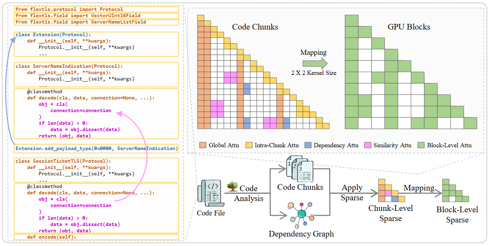

# SabreCoder

SabreCoder is a sparse attention implementation for long-context code completion.



## Environment

Recommended:

```bash
conda env create -f environment.yml
conda activate sabrecoder
pip install --index-url https://download.pytorch.org/whl/cu118 torch
```

Or create the environment manually:

```bash
conda create -n sabrecoder python=3.12 -y
conda activate sabrecoder
pip install --index-url https://download.pytorch.org/whl/cu118 torch
pip install -r requirements.txt
```

Minimum runtime assumptions:

- Python `3.12`
- NVIDIA GPU with CUDA support
- PyTorch + Triton compatible with your local CUDA stack

## Data preparation

Expected input locations:

- LCC parquet files: `data/LCC_<lang>/data/`
- CrossCodeEval parquet files: `data/cceval/<lang>/`

Filter parseable samples:

```bash
python data/filter_parseable.py --out_dir data/_filtered_ts
```

Build LCC prompt buckets:

```bash
bash data/lcc_budget/run.sh \
  --in_dir data/_filtered_ts \
  --tokenizer deepseek-ai/deepseek-coder-1.3b-base \
  --allow_download
```

Build CrossCodeEval RAG prompts:

```bash
bash data/cceval_rag/run.sh \
  --tokenizer deepseek-ai/deepseek-coder-1.3b-base \
  --allow_download
```

Optional RepoEval-style prompt generation is available under `data/repoeval_rag/`.

## Benchmarking

Run a single prepared dataset:

```bash
python evaluation/benchmark.py \
  --model_name deepseek-ai/deepseek-coder-1.3b-base \
  --data_path data/_lcc_budget_prompts/LCC_python_test_ctx_12288_14336.jsonl \
  --max_samples 100 \
  --output_dir results
```

Run multiple discovered datasets in parallel:

```bash
bash scripts/run_sabrecoder_main_benchmark_parallel.sh \
  --model_name deepseek-ai/deepseek-coder-1.3b-base \
  --budgets "14336 12288" \
  --gpus "0 1"
```

For the lowest-level entrypoint with all SabreCoder flags exposed:

```bash
bash methods/sabrecoder/run_eval.sh
```
